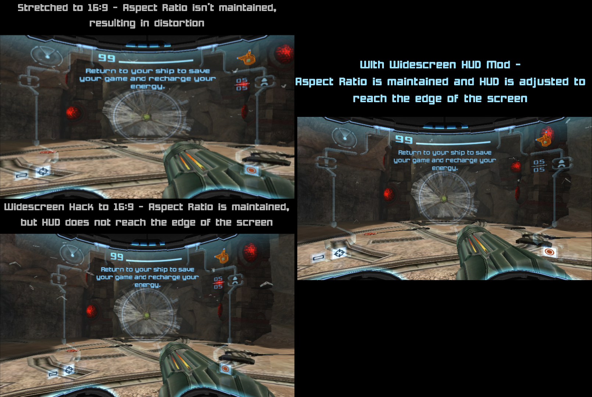
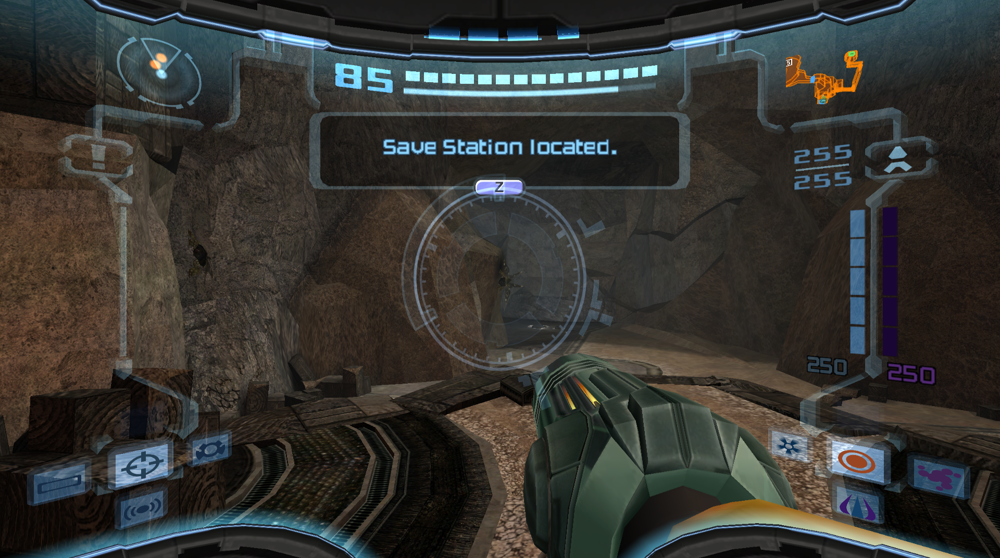
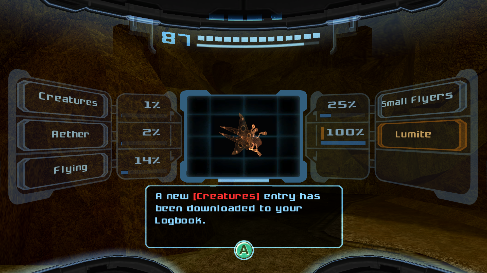

# Widescreen HUD Mod for Metroid Prime 2: Echoes (GameCube)

## Overview

This a simple mod for Metroid Prime 2: Echoes (NTSC-U) (G2ME01) for the Nintendo GameCube that adjusts the HUD to better match forced 16:9 widescreen hacks.



## Mod Installation (For Windows)

### Patching the game
1. Download from [Releases](https://github.com/Nystrata/echoeswidescreenhud/releases) and extract this mod's folder.
2. Make a copy of the game and rename it to `echoes.iso`. Place it in the mod's folder.
3. Run the included patch.bat
4. This will create a new ISO file called echoes_widescreenhud.iso with the mod installed

### Widescreen Gecko Codes for Dolphin (or PrimeHack)
In Dolphin, choose Force 16:9 for the Aspect Ratio (Options -> Graphics Settings -> General -> Aspect Ratio)  
Right-click the Metroid Prime 2: Echoes in the game list, click Properties, and apply the code to the Gecko Codes tab.  

These codes are for the NTSC-U copy of the game:  
```
$16:9 Widescreen [gamemasterplc]
C230256C 00000002
3DC04000 91C20000
C3420000 00000000
C236D684 00000004
3DC03FAA 61CEAAAB
91C20000 C2620000
ED330272 ED6A4824
60000000 00000000
```
[(Source)](https://wiki.dolphin-emu.org/index.php?title=Metroid_Prime_2:_Echoes_(GC)#16:9_Aspect_Ratio_Fix)

**Make sure Widescreen Hack is *disabled* in Dolphin!**  
When Widescreen Hack is enabled, Dolphin's current widescreen detection will cause the game to flicker between normal view and stretched view. It's recommended to disable it while playing this game in the official Dolphin releases.  
To disable Widescreen Hack, go to Options -> Graphics Settings -> Enhancements -> Uncheck Widescreen Hack  

### Applying Widescreen Gecko Code in Nintendont ###
For Nintendont, you can use the supplied G2ME01.gct codes file in the extras folder.  
Or, use G2ME1R.gct for Randovania Echoes Randomizer games.

## Mod Installation (For Not Windows)
* Extract the game files (You can use [NODTool](https://github.com/AxioDL/nod) or any app that can extract the full game filesystem and rebuild it. You can also use Dolphin to extract if you do not care about rebuilding the ISO)
* Use a vcdiff xdelta3 patcher to patch files/GGuiSys.pak in the game files with this mod's vcdiff/GGuiSys.pak_widescreen.vcdiff file
* Replace the original game's GGuiSys.pak with the newly patched GGuiSys.pak (make sure the name is exactly GGuiSys.pak)
* Rebuild the ISO (Or start the game directly from extracted files if using Dolphin (File -> Open, browse for sys/main.dol))
* Apply the cheat codes to the emulator/loader from above

## Randovania Compatibility ##
To use this with [Randovania randomizer](https://github.com/randovania/randovania),  
create a vanilla game with the Widescreen HUD mod first, then select it as the Input ISO when exporting the game from Randovania.  

After exporting, in Dolphin,  
right-click the Metroid Prime 2: Randomizer in the game list, click Properties, and apply the codes to the Gecko Codes tab.  
(In Dolphin, Metroid Prime 2: Randomizer's settings are stored seperately from the vanilla game's settings.)

> While mod does work with Randovania, it is *not* supported by Randovania  developers.  
> Do not report bugs to the Randovania developers while using this mod.

## Other Details

**Files changed** 
- GGuiSys.pak
  - eef43aa1.FRME 
    - Combat Visor, Dark Visor, Echo Visor
  - e6f37215.FRME
    - Helmet overlay
  - f7ec0850.FRME 
    - Scan Visor
  - 88738d60.FRME
    - Morph Ball HUD

**To-Do**  
- Rescale Beam/Visor icons
- Adjust map screen
- Adjust pause menu


### Special Thanks  
- Yonder, for use of their [editor](https://github.com/xchellx/three.js)
- Aruki, for the original [Widescreen Hud Mod for Metroid Prime](https://wiki.dolphin-emu.org/index.php?title=Metroid_Prime_(GC)#16:9_HUD_Mod)
- The [Metroid Prime Modding Discord Server](https://discord.gg/pTQZcFS) and [Retro Modding Wiki](https://wiki.axiodl.com/w/Main_Page)

This mod includes [NODTool](https://github.com/AxioDL/nod) to build the new ISO and xdelta3 for patching.

### Screenshots



More screenshots can be found in [extras/images/](https://github.com/Nystrata/echoeswidescreenhud/tree/main/extras/images/)
***

nys
